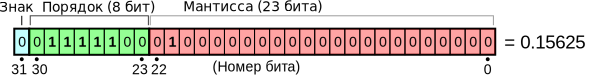
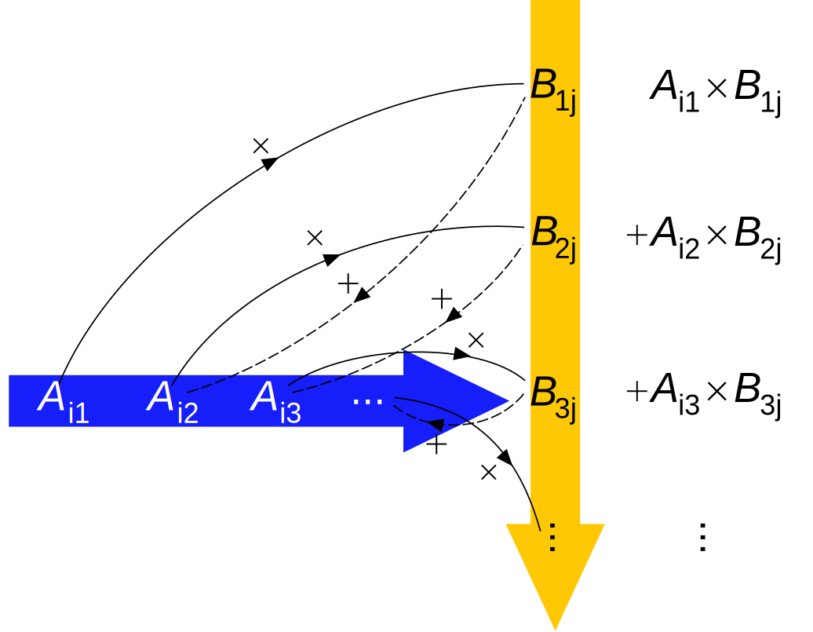

# Добрый день, группа 312!
<style type="text/css">
div.sourceCode {
  font-size: 1.2em;
}
section.slide > pre {
  font-size: 0.8em;
}

.reveal pre {
  width: 99%;
}
.reveal pre code {
  font-size: 1.2em;
}
.yellow-box {
  background-color: #afa;
}
.sparse-matrix img {
  height: 450px;
}
.twocolumn {
  -moz-column-count: 2;
  -webkit-column-count: 2;
}
</style>

## План занятия
- числа с плавающей точкой
- матричные нормы
- умножение квадратных матриц
- первая задача

Материалы к занятиям: https://zenderro.github.io/programming-semester-5/
email: [andrey.zenzinov@math.msu.ru](mailto:andrey.zenzinov@math.msu.ru)

# Числа с плавающей точкой
Плавающая точка — метод представления подмножества рациональных чисел (бывает тип комплексных чисел с плавающей точкой):

$
x = (-1)^{ {\color{#0CC}{sign} } } · 1.\overline{ {\color{#F00} {significand} } } · 2^{ {\color{#0C2}{exponent - bias} } }$

32-битное число (float):


Смещенный порядок (biased exponent): $p = exp - 127$

Нормированная мантисса (normalized significand): ведущий бит опускается и считается равным единице

На картинке мантисса — $ \color{#444}{1}.01000…0 $

[Подробнее](http://floating-point-gui.de/basic/)

[Подробнее на Wikipedia](https://en.wikipedia.org/wiki/Floating_point) (и далее — про стандарт [IEEE 754](https://en.wikipedia.org/wiki/IEEE_floating_point))

# Особые значения
1. Мантисса — двоичная дробь. Не всякая десятичная дробь представляется как конечная двоичная.
$1/5$ ($0.2$) записывается в `double` как:
$0.2000000000000000\color{red}{11102230246251565404236316680908203125}$
$⇒$ для финансовых приложений нужно использовать десятичную запись с фиксированной точкой и строго заданными правилами округления

2. [Денормализованные числа](https://ru.wikipedia.org/wiki/Денормализованные_числа) — порядок = 0, но мантисса не может быть записана в нормированном виде — число записывается в денормализованном виде, что вызывает потерю точности значащих цифр.

2. **NaN** (не-число) (все биты поряка установлены) — возвращается в операциях, результат которых не определён ($0/0$, $\sqrt{-1}$)

3. **Infinity** ($±∞$) — возвращается при делении на 0 или переполнении (в дисплейных классах вместо ∞ — исключение)

# Исключения
Floating Point Exception (SIGFPE):

- некорректная операция ($\sqrt{-1}$)
- деление на 0 (частая причина — $n=1$ в $x/(n-1)$)
- переполнение (overflow; частая причина — бесконечный цикл/невыполнение условия выхода из цикла, например, сравнение чисел с плавающей точкой оператором `==`)
- [антипереполнение](https://ru.wikipedia.org/wiki/Исчезновение_порядка) (underflow; частая причина — обращение к неинициализированному элементу массива или выход за границы массива)

Segmentation Fault (SIGSEGV):

- обращение по нулевому или неинициализированному указателю (не была выделена память или не удалось выделить блок памяти нужного размера)
- выход за границы массива (не всегда приводит к исключению, можно уточнить с помощью `valgrind`)


# Постановка задачи
𝐌${}_n$ — кольцо матриц n×n над ℂ (со сложением и умножением на константу можно рассматривать как векторное пространство над ℂ)

I — единичная матрица (E — матрица погрешности)

1. Решение линейной системы:
  найти вектор $x$, такой, что $Ax = b$
2. Обращение матрицы:
  найти матрицу $A^{-1}$, такую, что $AA^{-1} = I$

Для численных методов задача осложняется: даны значения $\hat{A}, \hat{b}$ с погрешностью, т.к. на практике не все действительные числа могут быть точно представлены в виде чисел с плавающей точкой; арифметические операции тоже вносят погрешность.

# Векторные и матричные нормы

Векторная норма ‖·‖ : 𝐕 → $ ℝ_+ $:

1. Разделяет точки: ‖x‖ = 0 ⇔ x = 0
2. Однородна: λ ∈ ℂ ⇒ ‖λx‖ = |λ|·‖x‖
3. Удовлетворяет неравенству треугольника: ‖x + y‖ ⩽ ‖x‖ + ‖y‖

Матричная норма — п.1–3 и:

4. Удовлетворяет неравенству треугольника по произведению: $‖AB‖ ⩽ ‖A‖·‖B‖$
(получается, что не всякая векторная норма является матричной)

Свойства:
- $‖I‖ ⩾ 1$
- $‖A^{-1}‖·‖A‖ ⩾ 1$

# Подчинённые матричные нормы

Для нормы $‖·‖$ на ℂ${}^n$ определим матричную (*подчинённую*, *индуцированную*) норму на 𝐌${}_n$ по формуле:
$$ ‖A‖ ≡ \max\limits_{‖x‖=1} ‖Ax‖. $$

Для подчинённой нормы $‖I‖=1$ и $‖Ax‖ ⩽ ‖A‖·‖x‖$

Основные нормы для этого курса:

1. Максимальная столбцовая норма ($𝐋^1$): $‖A‖_{1} = \max\limits_{1⩽j⩽n} \sum\limits_{i=1}^n |a_{ij}| \qquad ‖x‖_{1} = Σ|x_{i}|$
2. Максимальная строчная норма ($𝐋^∞$): $‖A‖_{∞} = \max\limits_i \sum\limits_j |a_{ij}| \qquad ‖x‖_∞ = \max |x_{i}|$
3. Спектральная норма ($𝐋^2$) ($λ$ — собственное значение):
$$‖A‖_{2} = \max \{\sqrt{λ} \; | \; ∃v : Av = λv\} \qquad ‖x‖_2 = \sqrt{Σx_{i}^2}$$

Спектральная норма в первой задаче не используется.

# Вычислительные ошибки и число обусловленности

Пусть $x$ — точное решение системы $Ax=b$, а $\hat{x}$ — приближённое, полученное с помощью численных методов.
Назовём **числом обусловленности** ($κ(A)$, cond($A$)): $κ(A) ≡ ‖A‖·‖A^{-1}‖ \; \mbox{(для невырожденных матриц)} $

**Невязка**: $r ≡ b - A\hat{x}$

Относительная погрешность приближённого решения: $ \dfrac{‖x-\hat{x}‖}{‖x‖} ⩽ κ(A)\dfrac{‖r‖}{‖b‖}. $

Свойства числа обусловленности:

1. $κ(A) ⩾ 1$
2. $κ(A) = κ(A^{-1})$
3. $κ(AB) ⩽ κ(A)κ(B)$
4. $κ(A) ⩾ \left| \dfrac{λ_{max}(A)}{λ_{min}(A)} \right|$

# Умножение матриц



# Умножение квадратных матриц

Тривиальная реализация:
```c
for (i = 0; i < n; i++) {
    for (j = 0; j < n; j++) {
        c[i * n + j] = 0.;
        for (k = 0; k < n; k++) {
            c[i * n + j] += a[i * n + k] * b[k * n + j];
        }
    }
}
```

Блочная реализация (размер блока — порядка $\sqrt{\dfrac{L1}{3}}$)
```c
for (i = 0; i < n / BLOCK; i++) {
    for (j = 0; j < n / BLOCK; j++) {
        zero_block(c, i, j);
        for (k = 0; k < n / BLOCK; k++) {
            multiply_block(a, b, temp, i, j, k);
            put_block(c, temp, i, j);
        }
    }
}
```

# Умножение матриц (современное состояние исследований)
Вычислительная сложность тривиального алгоритма — $O(n^3)$ (т.е. если реализация умножения работает 1 с. на матрице размера $1000×1000$, то она будет работать 8 с. на матрице размера $2000×2000$, 64 с. на матрице размера $4000×4000$ и т.д.). Развёртывание цикла, блочные оптимизации и т.п. могут только уменьшить константу.

Минимальный теоретически возможный порядок — $O(n^2)$, т.к. результат зависит от всех $2n^2$ элементов входных матриц, но вопрос минимальной достижимой сложности на настоящее время не решён.

Лучший применимый на практике алгоритм — [Strassen](https://en.wikipedia.org/wiki/Strassen_algorithm) (1969), сложность — $O(n^{2.807355})$, есть проблемы с численной устойчивостью.

Лучший алгоритм — [Coppersmith-Winograd](https://en.wikipedia.org/wiki/Coppersmith–Winograd_algorithm), с последующими улучшениями (2014) сложность — $O(n^{2.3728639})$, но константа и производительность используемых операций не позволяет использовать его на практике с ощутимым преимуществом (проблемы с устойчивостью тоже никуда не деваются).

# Невязка
Невязка (residual) — вектор (матрица) погрешности вычислений. Нас интересует норма невязки.

- решение линейной системы: $‖A\hat{x}-b‖$ / $‖b‖$

  умножить сгенерированную матрицу на вектор полученного решения и вычесть правую часть (сумма нечётных столбцов A)

- обращение матрицы: $‖AA^{-1} - I‖$

  умножить сгенерированную матрицу на другую* сгенерированную матрицу и вычесть единичную

  Для «хороших» матриц наша цель по невязке порядка $10^{-16}$

# Общие требования к программам

Выполняемые в этом семестре программы должны соответствовать [требованиям](LinearSystemsTasks.pdf).

Давайте их разберём подробнее.

# Формулы для матриц

$i, j = 0…(n-1)$:

Симметричная: $a_{ij} = |i-j|$ — по возможности тестируйте на больших размерах этой или следующей матрицы

Симметричная без нулей на диагонали: $a_{ij} = |i-j| + 1$

Матрица Гильберта: $H_{ij} = \dfrac{1}{i+j+1}$ — нет смысла тестировать на размерах >100

Обратите внимание, что в требованиях $i, j = 1…n$ и формулы там отличаются.

Для нормы $𝐋^2$ число обусловленности матрицы Гильберта $5×5$:
$$ κ(H) ≈ 4.8 · 10^5 $$

Сложность алгоритма $O(n^k)$ означает, что для задачи «размера» $n$ выполнение алгоритма требует не более, чем $C·n^k$ (члены младших степеней можно отбросить путём увеличения константы).


# Разбор аргументов командной строки

```c
#define DECIMAL 10

// Пример: на вход программы подаётся имя файла или два числа
int main (int argc, char * argv[]) {
    int a;
    int b;
    
    if (argc == 1 || argc > 3) {
        printf("Неверное количество аргументов\n");
        return -1;
    }
    switch(argc) {
        case 2: {
            // открываем файл, считываем данные из файла, закрываем файл
            ...
            break;
        }
        case 3: {
            // считываем данные из аргументов
            a = (int)strtol(argv[1], &endptr, DECIMAL);
            b = (int)strtol(argv[2], &endptr, DECIMAL);
            break;
        }
    }
    
    ...
      
    return 0;
}
```

# Измерение времени работы функции
Не следует использовать:

- `time()` — «календарное» время; точность — 1 секунда; между двумя измерениями может измениться произвольным образом, вплоть до перехода назад (переход на зимнее время; перевод часов вручную)
- `clock()` — точность — 1 микросекунда; 32-битный счётчик, переполняется за час с небольшим.
- `gettimeofday` — «календарное» время, может идти назад

Нужно использовать:
**`clock_gettime(CLOCK_MONOTONIC)`{.c}**
— таймер с наносекундным разрешением; предназначен именно для измерения промежутков времени в программе с высокой точностью (специфичен для Linux).

# Время работы с clock_gettime
`#include <unistd.h>`{.c}
Прототип:
```c
struct timespec {
    time_t tv_sec;  // секунды
    long tv_nsec;   // наносекунды
}  // Объявлено в unistd.h
```

`int clock_gettime(clockid_t clk_id, struct timespec *tp)`{.c}

Значения `clockid_t`:

- `CLOCK_MONOTONIC` — реальное время от произвольной точки отсчёта (можно использовать только как разность);
- `CLOCK_PROCESS_CPUTIME_ID` — использование процессорного времени;
- `CLOCK_THREAD_CPUTIME_ID` — использование процессорного времени потоком

Последние два значения понядобятся в третьей задаче.

# Пример использования (C++ или GNU90 С)
Компилировать лучше с `-std=c99`, т.к. в стандартах C89 и C90 нет типа `long long`{.c}. [Источник](https://github.com/olekristensen/LongingFastForward/blob/
1201aec0f10f39fc21af4b3de9a98ecd306643dc/Experiments/lffCinderCapture/lib/libjp4/clock.h), там же есть реализация для Mac OS X.

При компиляции необходимо добавить ключ `-D_POSIX_C_SOURCE=199309L`

```c
#include <time.h>

#define GIGA_MODIFIER 1e9
#define KILO_MODIFIER 1e3
#define MICRO_MODIFIER 1e-6

unsigned long long currentTimeNano()
{
    struct timespec t;
    clock_gettime(CLOCK_MONOTONIC, &t);
    return (long long)(t.tv_sec * GIGA_MODIFIER + t.tv_nsec);
}

unsigned long long currentTimeMillis()
{
    struct timespec t;
    clock_gettime(CLOCK_MONOTONIC, &t);
    return (long long)(t.tv_sec * KILO_MODIFIER + t.tv_nsec * MICRO_MODIFIER);
}

unsigned long long time = 0;
time = currentTimeNano();
Solve(n, a, b, tmp_double, tmp_int, debug);
time = currentTimeNano() - time;
printf("Time: %lld ns\n", time);
CheckAnswer(n, a, b);
```

# Пример использования (C89)
Этот пример должен собираться в дисплейных классах с параметрами компилятора по умолчанию. [Источник](https://github.com/EverlastingFire/informatica/blob/128519be92eb34b9c09859272d0187252506da5b/c/euclide/timediff.c)
```c
#include <time.h>

#define GIGA_MODIFIER 1e9
#define NANO_MODIFIER 1e-9

struct timespec diff(struct timespec start, struct timespec end)
{
    struct timespec temp;
    if ((end.tv_nsec - start.tv_nsec) < 0) {
        temp.tv_sec = end.tv_sec - start.tv_sec - 1;
        temp.tv_nsec = GIGA_MODIFIER + end.tv_nsec - start.tv_nsec;
    } else {
        temp.tv_sec = end.tv_sec - start.tv_sec;
        temp.tv_nsec = end.tv_nsec - start.tv_nsec;
    }
    return temp;
}

struct timespec time_start;
struct timespec time_end;
clock_gettime(CLOCK_MONOTONIC, &time_start);
Solve(n, a, b, tmp_double, tmp_int, debug);
clock_gettime(CLOCK_MONOTONIC, &time_end);
time_end = diff(time_start, time_end);
printf("Time: %lf s\n",
       (double)(time_end.tv_sec + time_end.tv_nsec * NANO_MODIFIER));
```

# Задание

Написать программу в соответствии с требованиями, реализующую ввод матрицы, вывод куска матрицы на экран и расчёт времени. Предполагается, что написанная программа будет частью первого задания.

https://classroom.github.com/a/xynYTZ1Z

Замечания:

1. Реализация чтения матрицы из файла, генерация матриц по формулам из [списка требований](LinearSystemsTasks.pdf).
2. Должна быть реализована обработка ошибок (список на следующем слайде) с возвращением соответствующего кода ошибки.
3. Должна быть строка `Time:` при выводе времени. Для этого задания можно считать время генерации матрицы. В зачётном задании время генерации матрицы не должно входить в расчёт времени.

# Обработка ошибок

Коды ошибок:

-1. Некорректные аргументы:

   - неправильное количество аргументов;
   - некорректные значения аргументов ($n\leq0$, $m\leq0$, $m > n$)
   - не удалось считать число для n, m или k;
   - некорректное значение k;
   - при k == 0 не указан файл;

-2. Не удалось выделить память

-3. Ошибки чтения файла:

   - указанного файла не существует;
   - файл пуст;
   - не удалось считать матрицу из файла;
