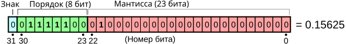
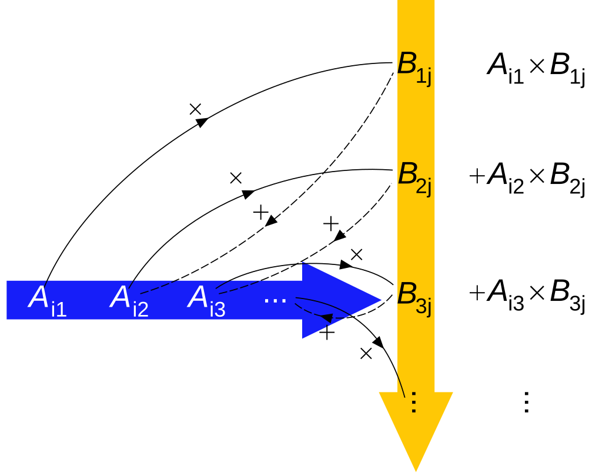

# Добрый день, группа 312!
<style type="text/css">
div.sourceCode {
  font-size: 1.2em;
}
section.slide > pre {
  font-size: 0.8em;
}

.reveal pre {
  width: 99%;
}
.reveal pre code {
  font-size: 1.2em;
}
.yellow-box {
  background-color: #afa;
}
.sparse-matrix img {
  height: 450px;
}
.twocolumn {
  -moz-column-count: 2;
  -webkit-column-count: 2;
}
</style>

## План занятия
- числа с плавающей точкой
- матричные нормы
- умножение квадратных матриц
- метод Гаусса, Жордана
- LU, метод Холецкого
- QR-методы

Материалы к занятиям: https://zenderro.github.io/programming-semester-5/
email: [andrey.zenzinov@math.msu.ru](mailto:andrey.zenzinov@math.msu.ru)

# Числа с плавающей точкой
Плавающая точка — метод представления подмножества рациональных чисел (бывает тип комплексных чисел с плавающей точкой):

$
x = (-1)^{ {\color{#0CC}{sign} } } · 1.\overline{ {\color{#F00} {significand} } } · 2^{ {\color{#0C2}{exponent - bias} } }$

32-битное число (float):


Смещенный порядок (biased exponent): $p = exp - 127$

Нормированная мантисса (normalized significand): ведущий бит опускается и считается равным единице

На картинке мантисса — $ \color{#444}{1}.01000…0 $

[Подробнее](http://floating-point-gui.de/basic/)

[Подробнее на Wikipedia](https://en.wikipedia.org/wiki/Floating_point) (и далее — про стандарт [IEEE 754](https://en.wikipedia.org/wiki/IEEE_floating_point))

# Особые значения
1. Мантисса — двоичная дробь. Не всякая десятичная дробь представляется как конечная двоичная.
$1/5$ ($0.2$) записывается в `double` как:
$0.2000000000000000\color{red}{11102230246251565404236316680908203125}$
$⇒$ для финансовых приложений нужно использовать десятичную запись с фиксированной точкой и строго заданными правилами округления

2. [Денормализованные числа](https://ru.wikipedia.org/wiki/Денормализованные_числа) — порядок = 0, но мантисса не может быть записана в нормированном виде — число записывается в денормализованном виде, что вызывает потерю точности значащих цифр.

2. **NaN** (не-число) (все биты поряка установлены) — возвращается в операциях, результат которых не определён ($0/0$, $\sqrt{-1}$)

3. **Infinity** ($±∞$) — возвращается при делении на 0 или переполнении (в дисплейных классах вместо ∞ — исключение)

# Исключения
Floating Point Exception (SIGFPE):

- некорректная операция ($\sqrt{-1}$)
- деление на 0 (частая причина — $n=1$ в $x/(n-1)$)
- переполнение (overflow; частая причина — бесконечный цикл/невыполнение условия выхода из цикла, например, сравнение чисел с плавающей точкой оператором `==`)
- [антипереполнение](https://ru.wikipedia.org/wiki/Исчезновение_порядка) (underflow; частая причина — обращение к неинициализированному элементу массива или выход за границы массива)

Segmentation Fault (SIGSEGV):

- обращение по нулевому или неинициализированному указателю (не была выделена память или не удалось выделить блок памяти нужного размера)
- выход за границы массива (не всегда приводит к исключению, можно уточнить с помощью `valgrind`)


# Постановка задачи
𝐌${}_n$ — кольцо матриц n×n над ℂ (со сложением и умножением на константу можно рассматривать как векторное пространство над ℂ)

I — единичная матрица (E — матрица погрешности)

1. Решение линейной системы:
  найти вектор $x$, такой, что $Ax = b$
2. Обращение матрицы:
  найти матрицу $A^{-1}$, такую, что $AA^{-1} = I$

Для численных методов задача осложняется: даны значения $\hat{A}, \hat{b}$ с погрешностью, т.к. на практике не все действительные числа могут быть точно представлены в виде чисел с плавающей точкой; арифметические операции тоже вносят погрешность.

# Векторные и матричные нормы

Векторная норма ‖·‖ : 𝐕 → $ ℝ_+ $:

1. Разделяет точки: ‖x‖ = 0 ⇔ x = 0
2. Однородна: λ ∈ ℂ ⇒ ‖λx‖ = |λ|·‖x‖
3. Удовлетворяет неравенству треугольника: ‖x + y‖ ⩽ ‖x‖ + ‖y‖

Матричная норма — п.1–3 и:

4. Удовлетворяет неравенству треугольника по произведению: $‖AB‖ ⩽ ‖A‖·‖B‖$
(получается, что не всякая векторная норма является матричной)

Свойства:
- $‖I‖ ⩾ 1$
- $‖A^{-1}‖·‖A‖ ⩾ 1$

# Подчинённые матричные нормы

Для нормы $‖·‖$ на ℂ${}^n$ определим матричную (*подчинённую*, *индуцированную*) норму на 𝐌${}_n$ по формуле:
$$ ‖A‖ ≡ \max\limits_{‖x‖=1} ‖Ax‖. $$

Для подчинённой нормы $‖I‖=1$ и $‖Ax‖ ⩽ ‖A‖·‖x‖$

Основные нормы для этого курса:

1. Максимальная столбцовая норма ($𝐋^1$): $‖A‖_{1} = \max\limits_{1⩽j⩽n} \sum\limits_{i=1}^n |a_{ij}| \qquad ‖x‖_{1} = Σ|x_{i}|$
2. Максимальная строчная норма ($𝐋^∞$): $‖A‖_{∞} = \max\limits_i \sum\limits_j |a_{ij}| \qquad ‖x‖_∞ = \max |x_{i}|$
3. Спектральная норма ($𝐋^2$) ($λ$ — собственное значение):
$$‖A‖_{2} = \max \{\sqrt{λ} \; | \; ∃v : Av = λv\} \qquad ‖x‖_2 = \sqrt{Σx_{i}^2}$$

Спектральная норма в первой задаче не используется.

# Вычислительные ошибки и число обусловленности

Пусть $x$ — точное решение системы $Ax=b$, а $\hat{x}$ — приближённое, полученное с помощью численных методов.
Назовём **числом обусловленности** ($κ(A)$, cond($A$)): $κ(A) ≡ ‖A‖·‖A^{-1}‖ \; \mbox{(для невырожденных матриц)} $

**Невязка**: $r ≡ b - A\hat{x}$

Относительная погрешность приближённого решения: $ \dfrac{‖x-\hat{x}‖}{‖x‖} ⩽ κ(A)\dfrac{‖r‖}{‖b‖}. $

Свойства числа обусловленности:

1. $κ(A) ⩾ 1$
2. $κ(A) = κ(A^{-1})$
3. $κ(AB) ⩽ κ(A)κ(B)$
4. $κ(A) ⩾ \left| \dfrac{λ_{max}(A)}{λ_{min}(A)} \right|$

# Умножение матриц



# Умножение квадратных матриц

Тривиальная реализация:
```c
for (i = 0; i < n; i++) {
    for (j = 0; j < n; j++) {
        c[i * n + j] = 0.;
        for (k = 0; k < n; k++) {
            c[i * n + j] += a[i * n + k] * b[k * n + j];
        }
    }
}
```

Блочная реализация (размер блока — порядка $\sqrt{\dfrac{L1}{3}}$)
```c
for (i = 0; i < n / BLOCK; i++) {
    for (j = 0; j < n / BLOCK; j++) {
        zero_block(c, i, j);
        for (k = 0; k < n / BLOCK; k++) {
            multiply_block(a, b, temp, i, j, k);
            put_block(c, temp, i, j);
        }
    }
}
```

# Умножение матриц (современное состояние исследований)
Вычислительная сложность тривиального алгоритма — $O(n^3)$ (т.е. если реализация умножения работает 1 с. на матрице размера $1000×1000$, то она будет работать 8 с. на матрице размера $2000×2000$, 64 с. на матрице размера $4000×4000$ и т.д.). Развёртывание цикла, блочные оптимизации и т.п. могут только уменьшить константу.

Минимальный теоретически возможный порядок — $O(n^2)$, т.к. результат зависит от всех $2n^2$ элементов входных матриц, но вопрос минимальной достижимой сложности на настоящее время не решён.

Лучший применимый на практике алгоритм — [Strassen](https://en.wikipedia.org/wiki/Strassen_algorithm) (1969), сложность — $O(n^{2.807355})$, есть проблемы с численной устойчивостью.

Лучший алгоритм — [Coppersmith-Winograd](https://en.wikipedia.org/wiki/Coppersmith–Winograd_algorithm), с последующими улучшениями (2014) сложность — $O(n^{2.3728639})$, но константа и производительность используемых операций не позволяет использовать его на практике с ощутимым преимуществом (проблемы с устойчивостью тоже никуда не деваются).


# Приведение матрицы к треугольному виду (метод Гаусса)

$$
\begin{array}{cllll|l}
1 & c_{1,2} & \dots & c_{1,n-1} & c_{1,n} & y_1 \\
  &  a^{(1)}_{2,2}  & \dots         & a^{(1)}_{2,n-1} & a^{(1)}_{2,n} & b^{(1)}_2 \\
  & \vdots & \vdots & \vdots & \vdots & \vdots \\
  & a^{(1)}_{n-1, 2} & \dots & a^{(1)}_{n-1, n-1} & a^{(1)}_{n-1, n} & b^{(1)}_{n-1} \\
  & a^{(1)}_{n, 2} & \dots & a^{(1)}_{n, n-1} & a^{(1)}_{n,n} &b^{(1)}_n
\end{array}
$$
В каждом столбце обнуляем часть под диагональю с использованием элементарного преобразования «вычесть строку с коэффициентом» (метод применим только в случае $\det \, A_k ≠ 0$). Сложность — $2/3 n^3 + O(n^2) $
$$ \mathbf{a}_k = \dfrac{\mathbf{a}_k}{a_{k,k}}, \qquad y_k = \dfrac{b_k}{a_{k,k}}; \qquad \mathbf{a}_i = \mathbf{a}_i - \dfrac{a_{i,k}}{a_{k,k}} \mathbf{a}_k, \qquad b_i = b_i - \dfrac{a_{i,k}}{a_{k,k}} y_k $$

# Реализация метода Гаусса
$$
\begin{array}{ccllll|l}
& \bbox[#afa,3pt]{i} &  \bbox[#afa,3pt]{⟶} \\
& 1 & c_{1,2} & \dots & c_{1,n-1} & c_{1,n} & y_1 \\
\bbox[#ff0,3pt] j &   &  a^{(1)}_{2,2}  & \dots         & a^{(1)}_{2,n-1} & a^{(1)}_{2,n} & b^{(1)}_2 \\
\bbox[#ff0,3pt] ↓&  & \vdots & \vdots & \vdots & \vdots & \vdots \\
&  & a^{(1)}_{n-1, 2} & \dots & a^{(1)}_{n-1, n-1} & a^{(1)}_{n-1, n} & b^{(1)}_{n-1} \\
&  & a^{(1)}_{n, 2} & \dots & a^{(1)}_{n, n-1} & a^{(1)}_{n,n} &b^{(1)}_n \\
& & \bbox[#faa,3pt]k & \bbox[#faa,3pt]⟶
\end{array}
$$

<pre>
for <span class=green-box>i := 0…(n-1)</span>
  for k := (i+1)…(n-1) A[i, k] := A[i, k] / A[i, i]
  A[i, i] := 1
  for <span class=yellow-box>j := (i+1)…(n-1)</span>
    for <span class=red-box>k := (i+1)…(n-1)</span>
      A[j, k] := A[j, k] - A[i, k] * A[j, i]
    for <span class=red-box>k := 0…(m-1)</span> # размер правой части (1 или n)
      B[j, k] := B[j, k] - B[i, k] * A[j, i]
</pre>


# LU-разложение

На самом деле, предыдущие преобразования могут быть представлены в форме умножения на матрицы особого вида.

Зная такое разложение, можно применять его к различным наборам $x_m$, $b_m$ за время, сравнимое с однократным проведением метода Гаусса.

1. Умножение текущей строки на элемент, обратный к диагонали.

<pre>
  for k := (i+1)…(n-1) A[i, k] := A[i, k] / A[i, i]
  A[i, i] := 1
</pre>

$A'^{(i)} = D_i · A^{(i-1)} $ , где $D_i = \mathrm{diag} [ 1, 1, 1, …, {(a^{(i-1)}_{i,i})^{-1}}, 1, …, 1] $ (единичная с обратным к элементу $a_{i,i} $ на $i $-м месте)

# LU-разложение (II)

2. Обнуление столбца под текущим диагональным элементом.

<pre>
    for k := (i+1)…(n-1) A[j, k] := A[j, k] - A[i, k] * A[j, i]
</pre>

$A^{(i)} = L_i · A'^{(i)} $, где $L_i $: (единичная со столбцом обратных по сложению элементов под $i $-м диагональным элементом)

$$
\begin{pmatrix}
1  \\
 & \ddots & \\
 & & 1 \\
 & & -a^{(i-1)}_{i+1, i} & 1 \\
 & & \vdots & & \ddots \\
 & & -a^{(i-1)}_{n, i} & & & 1
\end{pmatrix}
$$

# LU-разложение (III)

Таким образом, применение прямого хода метода Гаусса можно представить как:
$$ L_n · D_n · … · L_1 · D_1 · A = U $$

где $U $ — верхнетреугольная матрица с единицами на диагонали.
Тогда $A = LU $, где $L = (L_n · D_n · … · L_1 · D_1)^{-1} $ — нижнетреугольная матрица (т.к. нижнетреугольные матрицы замкнуты по умножению).
С использованием такого разложения можно далее решать линейные системы с правой частью $A $ и произвольной левой частью за $O(n^2) $ операций:
$$L · U ·x = b$$
1. Обратным ходом метода Гаусса решаем систему с треугольной матрицей
$$ L · y = b $$
2. Обратным ходом метода Гаусса решаем вторую систему с треугольной матрицей:
$$ U · x = y $$

# Реализация LU-разложения
Формулы построены таким образом, что обе матрицы $L, U $ можно (и нужно для выполнения требований) хранить на месте исходной матрицы $A $ (единичная диагональ $U $ не хранится).

1. $l_{i,1} = a_{i,1} \qquad (i = 1…n) \qquad \qquad u_{1,k} = a_{1,k} \big/ l_{1,1} \qquad (k = 2…n) $
2. $\bbox[#faa,3px]{l_{i, k}} = \bbox[#faa,3px]{a_{i,k}} - \sum\limits_{j=1}^{k-1} \bbox[#aff,3px]{l_{i,j}} · \bbox[#faf,3px]{ u_{j,k}}
\qquad (1 < k ⩽ i, \quad i,k = 2…n) $
$\bbox[#afa,3px]{u_{i,k}} = \left(\bbox[#afa,3px]{a_{i, k}} - \sum\limits_{j=1}^{i-1} \bbox[#aff,3px]{l_{i,j}} · \bbox[#ffa,3px]{u_{j,k}} \right) \big/ \, \bbox[#faa,3px]{l_{i,i}}
\qquad (k > i > 1, \quad i, k = 2 … n) $

$$
\begin{pmatrix}
{l_{1,1}} & u_{1,2} & \bbox[#faf,3px]{u_{1, 3}} & \bbox[#ffa,3px]{u_{1, 4}} & … & & & u_{1,n} \\
{l_{2, 1}} & {l_{2, 2}} & \bbox[#faf,3px]{u_{2, 3}} & \bbox[#ffa,3px]{u_{2, 4}} & … & & & u_{2, n} \\
\bbox[#aff,3px]{l_{3, 1}} & \bbox[#aff,3px]{l_{3, 2}} & \bbox[#faa,3px]{l} & \bbox[#afa,3px]{u} & \bbox[#afa,3px]⟶ & & & a_{2, n} \\
\bbox[#faa,3px]↪︎ & \vdots & \vdots & & \ddots & & & \vdots \\
l_{n, 1} & l_{n, 2} & a_{n,3}  & & … & & & a_{n, n}
\end{pmatrix}
$$

# Обратный ход метода Гаусса
$$
\begin{array}{ccccc|c}
c_{1,1} & c_{1,2} & \dots & c_{1,n-1} & {c_{1,n}} & y_1 \\
  &  \bbox[#ffa,3px]{c_{2,2}}  & \bbox[#faf,3px]\dots         & \bbox[#faf,3px]{c_{2,n-1}} & \bbox[#faf,3px]{c_{2,n}} & \bbox[#fea,3px]{y_2} \\
  & &\ddots & \vdots & {\vdots} & \bbox[#aef,3px]{\vdots} \\
  & & & c_{n-1,n-1} & {c_{n-1, n}} & \bbox[#aef,3px]{y_{n-1}} \\
  & & & & c_{n,n} & \bbox[#aef,3px]{y_n}
\end{array}
$$

$ x_n = y_n \big/ c_{n,n} \qquad \qquad \bbox[#fea,3px]{x_i} = \left( \bbox[#fea,3px]{y_i }- \sum_{j=i+1}^n \bbox[#faf,3px]{c_{i,j}} ·  \bbox[#aef,3px]{x_j} \right) \big/ \bbox[#ffa,3px]{c_{i,i}} $

Сложность — $\dfrac{n·(n-1)}{2} ≈ O(n^2)$

# Реализация обратного хода


Во **внутреннем** цикле придерживаемся упорядоченного доступа к памяти.

1. Для решения линейной системы (правая часть — одна):

<pre>
for i:=(n-1) … 0
  for j:= (i+1) … n
    b[i] := b[i] - A[i, j] · b[j]
  b[i] := b[i] / A[i,i]
</pre>

2. Для обращения матрицы (правых частей — $n$, сложность — $O(n^3) $):

<pre>
for i := (n-1) … 0
  for j := (i+1) … n
    for k := 0 … (n-1)
      B[i, k] := B[i, k] - A[i, j] * B[j, k]
  for k := 0 … (n-1)
    B[i, k] := B[i, k] / A[i, i]
</pre>

# Метод Гаусса-Жордана
$$
\begin{array}{cllll|l}
1 & \bbox[#afa,5px]{0} & \dots & c_{1,n-1} & c_{1,n} & y_1 \\
  &  1  & \dots         & a^{(2)}_{2,n-1} & a^{(2)}_{2,n} & b^{(2)}_2 \\
  &  & \vdots & \vdots & \vdots & \vdots \\
  &  & \dots & a^{(2)}_{n-1, n-1} & a^{(2)}_{n-1, n} & b^{(2)}_{n-1} \\
  &  & \dots & a^{(2)}_{n, n-1} & a^{(2)}_{n,n} &b^{(2)}_n
\end{array}
$$

Единственное отличие — обнуляются элементы столбца не только под, но и над диагональю.

<pre>
for <span class=green-box>i := 0…(n-1)</span>
  MultiplyRow(A[i, i…(n-1)], 1 / A[i, i])
  for j :=  <span class=yellow-box><strong>0…(i-1),</strong></span> (i+1)…(n-1)</span>
    A[j, i…(n-1)] := SubtractRow(A[j, i…(n-1)], A[i, i…(n-1)], A[j, i])
    B[j, 0…(n-1)] := SubtractRow(B[j, 0…(n-1)], B[i, 0…(n-1)], A[j, i])
</pre>

# Симметричные матрицы

— матрицы, элементы которых симметричны относительно главной диагонали:
$$a_{ij} = a_{ji}$$

$$
\begin{pmatrix}
a_{11} & \bbox[#0ff, 3pt]{a_{12}} & \bbox[#0df, 3pt]{a_{13}} & \bbox[#0af, 3pt]{a_{14}} \\
\bbox[#0ff, 3pt]{a_{21}} & a_{22} & \bbox[#0ff, 3pt]{a_{23}} & \bbox[#0df, 3pt]{a_{24}} \\
\bbox[#0df, 3pt]{a_{31}} & \bbox[#0ff, 3pt]{a_{32}} & a_{33} & \bbox[#0ff, 3pt]{a_{34}} \\
\bbox[#0af, 3pt]{a_{41}} & \bbox[#0df, 3pt]{a_{42}} & \bbox[#0ff, 3pt]{a_{43}} & a_{44}
\end{pmatrix}
$$

# Симметричные матрицы

Для них достаточно хранить верхний треугольник:

$$
\begin{pmatrix}
a_{11} & \bbox[#0ff, 3pt]{a_{12}} & \bbox[#0df, 3pt]{a_{13}} & \bbox[#0af, 3pt]{a_{14}} \\
& a_{22} & \bbox[#0ff, 3pt]{a_{23}} & \bbox[#0df, 3pt]{a_{24}} \\
&  & a_{33} & \bbox[#0ff, 3pt]{a_{34}} \\
& & & a_{44}
\end{pmatrix}
$$

# Положительно определённые матрицы
— матрицы $A$, для которых $(Ax, x) > 0$ для любых векторов $x ∈ ℝ^n$.

Положительно определённые матрицы невырождены и имеют ненулевые главные
миноры.

Симметричная (самосопряжённая) матрица положительно определена ⇔ все её
собственные значения веществены и положительны.

# Метод Холецкого
Пусть $A$ — симметрична с ненулевыми главными минорами. 

Тогда: $$A = R^T · D · R$$,
где $R$ — невырожденная верхнетреугольная, а $D = diag(±1, ±1, ... , ±1)$.

Для комплексного общего случая (самосопряжённой матрицы с ненулевыми главными
минорами) получаем из $LU$-разложения $A = R^\ast · D · R$ , а в частном случае
вещественной $A$ получаем формулу выше. Для вещественной положительно
определённой к тому же $D = I$ .

Один из индикаторов для пошаговой проверки реализации: значения $d_{i,i}$ для
положительно определённой матрицы должны быть единичными. Можно начать
тестировать с диагональных матриц.

Сложность - $\frac{n^3}{3} + O(n^2)$ операций.

# Метод Холецкого
## Реализация (вещественный случай)
Вычисляем значения элементов построчно, сначала — элемент $d_{ii}$ диагональной
матрицы $D$ , потом — диагональный элемент $r_{ii}$ верхнетреугольной матрицы $R$, затем
— оставшиеся элементы $r_{i,i+1 ... n}$ матрицы $R$. 

Для вычисления каждого элемента нужно
запоминать только текущий элемент матрицы $A$ , поэтому можно сразу
перезаписывать элементы матрицы $A$ вновь найденными элементами матрицы $R$.

- $d_{ii} = sign(a_{ii} - \sum_{k=1}^{i-1}r^2_{ki}\cdot d_{kk})$ - хранится в отдельном векторе
- $r_{ii} = \sqrt{|a_{ii}-\sum_{k=1}^{i-1}r^2_{ki}\cdot d_{kk}|}$ - корень из модуля того же выражения, знак которого определяет $d_{ii}$
- $r_{ij} = \frac{a_{ij}-\sum_{k=1}^{i-1}r_{ki}\cdot d_{kk} \cdot r_{kj}}{r_{ii}\cdot d_{ii}}$, при этом $j = (i+1) ... n$

# Метод Холецкого
## Решение линейной системы

$$ R^T\cdot D \cdot R \cdot x = b  $$

1. $R^T \cdot z = b$ - система с нижнетреугольной матрицей, решается обратным ходом
метода Гаусса
2. $D \cdot y = z$ - просто меняем знаки элементов
3. $R \cdot x = y$ - система с верхнетреугольной матрицей, решается обратным ходом
метода Гаусса

**Обращение матрицы** — аналогично. Все шаги выполняются одновременно с n
правыми частями.

# Метод Холецкого
## Хранение матрицы в памяти

На месте матрицы $A$:

$$
\begin{pmatrix}
\bbox[#afa, 3pt]{r_{11}} & \bbox[#afa, 3pt]{r_{12}} & \bbox[#afa, 3pt]{r_{13}} & ... & \bbox[#afa, 3pt]{r_{1n}} \\
a_{12} & \bbox[#afa, 3pt]{r_{22}} & \bbox[#afa, 3pt]{r_{23}} & ... & \bbox[#afa, 3pt]{r_{2n}} \\
a_{13} & a_{23} & \bbox[#afa, 3pt]{r_{33}} & ... & \bbox[#afa, 3pt]{r_{3n}} \\
... & ... & ... & ... & ... \\
a_{1n} & a_{2n} & a_{3n} & ... & \bbox[#afa, 3pt]{r_{nn}}
\end{pmatrix}
$$

$D$ хранится в отдельном векторе.

# QR-разложение

Предыдущие методы могут увеличивать число обусловленности матрицы. Применение преобразований с унитарными матрицами не приводит у увеличению числа обусловленности, что ведёт к устойчивости методов к накоплению вычислительной погрешности.

**Теорема о QR-разложении**. Всякая невырожденная матрица $A$ может быть представлена в виде $A = QR$, где матрица $Q$ - ортогональная, а $R$ - верхнетреугольная с положительными элементами на главной диагонали. Это разложение единственно.

# Метод вращений

## Матрица вращений

$$ T_{ij}(\varphi) = 
\begin{pmatrix}
1 & & & & & & & & & & \\
& \ddots & & & & & & & & & \\
& & 1 & & & & & & & & \\
& & & cos \varphi &&  & & -sin\varphi & & & \\
& & & & 1 & & & & & & \\
& & & & & \ddots & & & & & \\
& & & & & & 1 & & & & \\
& & & sin\varphi & & & & cos\varphi & & & \\
& & & & & & & & 1 & & \\
& & & & & & & & & \ddots & \\
& & & & & & & & & & 1 
\end{pmatrix}
$$

# Метод вращений

Умножение слева на $T_{ij}(\varphi)$ проще рассматривать как операцию с параметрами:
$$T(i,j,\varphi)\cdot x = y$$, где:
- $y_k = x_k, k\ne i,j$;
- $y_i = x_i cos\varphi - x_j sin\varphi$;
- $y_j = x_i sin\varphi + x_j cos\varphi$.

Любой двумерный вектор $(x, y)$ можно повернуть так, что его вторая координата обнулится.

$$cos\varphi=\frac{x}{\sqrt{x^2+y^2}}, sin\varphi=\frac{-y}{\sqrt{x^2+y^2}}$$.

В результате такого поворота: $(x, y) ↦ (\sqrt{x^2+y^2}, 0) = (‖(x, y)‖, 0)$

При реализации можно использовать функцию `hypot`.

# Алгоритм метода вращений

$$
\begin{pmatrix}
‖a_1‖ & c_{12} & \cdots & c_{1,n-1} & c_{1,n} \\
& a^{(1)}_{22} & \cdots & a^{(1)}_{2,n-1} & a^{(1)}_{2,n} \\
& \vdots & \vdots & \vdots & \vdots \\
& a^{(1)}_{n-1,2} & \cdots & a^{(1)}_{n-1,n-1} & a^{(1)}_{n-1,n} \\
& a^{(1)}_{n,2} & \cdots & a^{(1)}_{n,n-1} & a^{(1)}_{n,n}
\end{pmatrix}
$$

- Для каждой строки $i=1 ... n$
- Для каждой строки $k=i+1 ... n$:
    - Найти угол $\varphi_{ij}$, обнуляющий вторую компоненту $(a_{ii}, a_{ki})$
    - Повернуть каждый столбец $j=i ... n$ на этот угол

Левая и верхняя части матрицы (столбцы $1...i − 1$ и строки $1...i − 1$ ) на последующих
шагах $i ... n$ не модифицируются.

Сложность - от $2 n^3 + O(n^2)$ до $5 n^3 + O(n^2)$ операций в зависимости от метода хранения данных.

# Метод отражений
## Матрица отражений

Идея: Отразить вектор относительно гиперплоскости $⟨x⟩^⟂$, где $‖x‖ = 1$.

Матрица отражения: $U(x)=I-2xx^\ast$, $‖x‖ = 1$.

Проще рассматривать умножение слева на $U(x)$ как операцию: $$U(x) · y = y − 2x(y, x)$$

Отражение может быть задано для подпространства:

$$
U_k=
\begin{pmatrix}
I_{k-1}&0\\
0& U(x)
\end{pmatrix}
$$

# Метод отражений
## Приведение матрицы к треугольному виду

Любой вектор $y$ можно отразить относительно гиперплоскости $⟨x⟩^⟂$ так, что все его координаты кроме первой обнулятся: $$x=\pm\frac{y-‖y‖e_1}{‖y-‖y‖e_1‖}$$

Таким образом, $y ↦‖y‖ · e1$

Чтобы найти вектор отражения вычисляются:
- «преднорма» y без первой компоненты: $s = Σ|y_i|^2$;
- $‖y‖ = \sqrt{|y_1|^2 + s}$;
- первая координата $x_1' = y_1 - ‖y‖$ и норма $‖x'‖ = \sqrt{|x_1'|^2+s}$
- нормированный вектор $x=x'/‖x'‖$.

# Алгоритм метода отражений

$$
\begin{pmatrix}
‖a_1‖ & c_{12} & \cdots & c_{1,n-1} & c_{1,n} \\
& a^{(1)}_{22} & \cdots & a^{(1)}_{2,n-1} & a^{(1)}_{2,n} \\
& \vdots & \vdots & \vdots & \vdots \\
& a^{(1)}_{n-1,2} & \cdots & a^{(1)}_{n-1,n-1} & a^{(1)}_{n-1,n} \\
& a^{(1)}_{n,2} & \cdots & a^{(1)}_{n,n-1} & a^{(1)}_{n,n}
\end{pmatrix}
$$

- Для каждого столбца $j=1...n$:
    - Найти вектор отражения $x_j$ размерности $n-j+1$;
    - Отразить столбцы $j...n$ относительно этого вектора.

Сложность - от $\frac{2n^3}{3} + O(n^2)$ до $\frac{10n^3}{3} + O(n^2)$ операций.

# QR-разложение методом отражений

Предлагается следующий способ хранения:

$$v = (r_{11}, r_{22}, r_{33}, \dots , r_{nn})$$

$$\begin{pmatrix}
x_{11} & r_{12} & \cdots & r_{1n} \\
x_{12} & \ddots & & \vdots \\
\vdots & \vdots & \ddots & \vdots \\
x_{1n} & x_{2n} & \cdots & x_{nn}
\end{pmatrix}$$

# Обращение матрицы

1. С помощью присоединённой матрицы:

    $$(A|I)↦(I|A^{-1})$$
    
    Как и в случае решения линейной системы, аналогичные преобразования
    выполняются и над правой частью.
    
2. С помощью $QR$-разложения.

    $$(QR)^{-1}=R^{-1}\cdot Q^T$$

    $$B\cdot Q^T = (Q\cdot B^T)^T$$

    $$Q = Q_k\dots Q_1 $$

